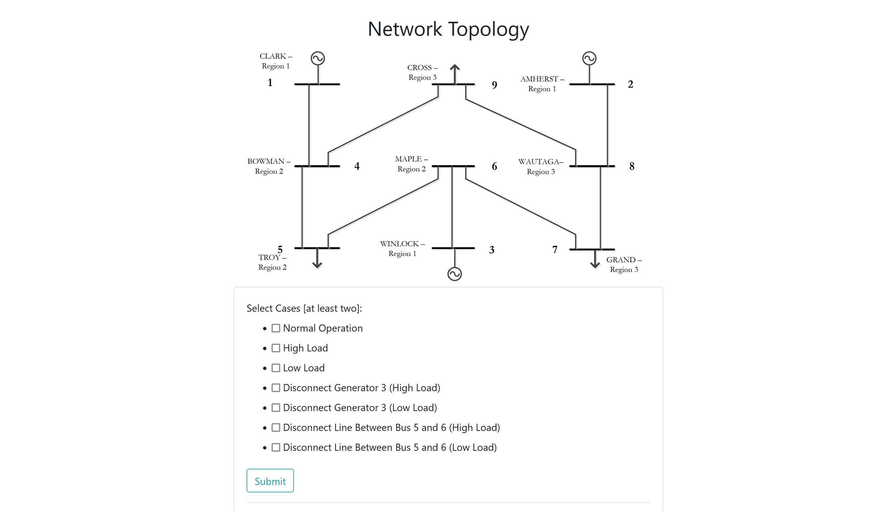
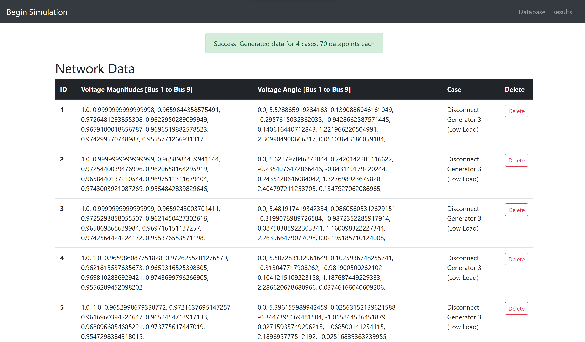
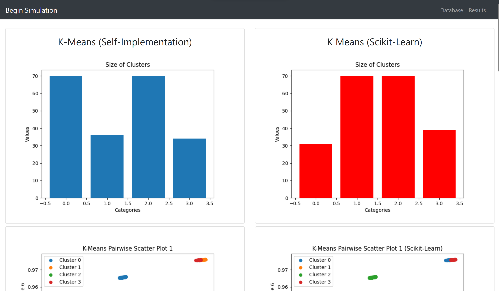

# EH2745 Assignment 2

A [web application](http://butterytoucan.eu.pythonanywhere.com/) that runs simulations on a PandaPower network, and performs Supervised and Unsupervised Machine Learning on the resulting time series dataset.

## Features
* Fully-functional and intuitive [web application](http://butterytoucan.eu.pythonanywhere.com/)
* Allows up to seven selectable cases for simulations
* Stores data in a sqlite database
* Displays time series data in a table
* Plots the results in several graphs
* Provides a dashboard for viewing the results
* Catches errors gracefully

## Installation Instructions
1. Clone this repository
2. Use Python 3.11 to run `pip install -r requirements.txt` (A virtual environment is highly recommended)
3. Use Python 3.11 to run `python run.py` (NOTE: for convenience, use the [web application](http://butterytoucan.eu.pythonanywhere.com/) instead!)

## Python Files Included
This project is created with (excluding files related to Flask):
* `application/Agent_KMeans.py`: Contains the class `AgentKMeans`
* `applicationAgent_KNN.py`: Contains the class `AgentKNN`
* `application/DataGenerator.py`: Contains the class `AgentKNN`

## Class Information

* `DataGenerator ` class represents an implementation of the K-Nearest Neighbors (KNN) algorithm.
  - Constructor: `__init__(self)` initializes the class instance and defines an empty PandaPower network.
  - Methods:
  - `source_network()`: This method creates an empty power system network and adds buses, transmission lines, generators, and loads to the network.    
  - `source_data(net, time_steps)`: This method generates load profile data for the network. It creates a DataFrame called profiles that contains random load values for each time step.      
  - `highload_data(net, time_steps)`: This method generates load profile data for a high load operation. It modifies the load values generated in the source_data method by adding a 10% increase to each load.      
  - `lowload_data(net, time_steps)`: This method generates load profile data for a low load operation. It modifies the load values generated in the source_data method by subtracting 10% from each load.     
  - `pq_controllers(net, ds)`: This method creates controllers to change the active and reactive power values of the loads based on the load profile data generated. It uses the ConstControl class from pandapower to set the power values.      
  - `output_writer(net, time_steps, output_dir)`: This method creates an OutputWriter object to log and save simulation results to an output file. It specifies the variables to log and the output file type.      
  - `operation_normal(net, timesteps)`: This method simulates the normal operation of the power system network. It generates load profile data using the source_data method, creates controllers using the pq_controllers method, and runs the time series simulation using the run_timeseries function from pandapower.      
  - `operation_highload(net, timesteps)`: This method simulates the high load operation of the power system network. It generates load profile data using the highload_data method, creates controllers using the pq_controllers method, and runs the time series simulation.      
  - `operation_lowload(net, timesteps)`: This method simulates the low load operation of the power system network. It generates load profile data using the lowload_data method, creates controllers using the pq_controllers method, and runs the time series simulation.      
  - `operation_genrdisconnect_highLoad(net, timesteps)`: This method simulates the high load operation with a disconnected generator. It disconnects generator 3 from the network, generates load profile data using the highload_data method, creates controllers using the pq_controllers method, and runs the time series simulation. After the simulation, the generator is reconnected.      
  - `operation_genrdisconnect_lowLoad(net, timesteps)`: This method simulates the low load operation with a disconnected generator. It disconnects generator 3 from the network, generates load profile data using the lowload_data method, creates controllers using the pq_controllers method, and runs the time series simulation. After the simulation, the generator is reconnected.      
  - `operation_disconnectline_highLoad(net, timesteps)`: This method simulates the high load operation with a disconnected transmission line. It disconnects the line between bus 5 and bus 6, generates load profile data using the highload_data method, creates controllers using the pq_controllers method, and runs the time series simulation. After the simulation, the line is reconnected.      
  - `operation_disconnectline_lowLoad(net, timesteps)`: This method simulates the low load operation with a disconnected transmission line. It disconnects the line between bus 5 and bus 6.

* `AgentKMeans` class represents an implementation of the K-means clustering algorithm.
  - Constructor: `__init__(self)` initializes the class instance.
  - Methods:
  -   `euclidean_distance(self, x1, x2)`: Calculates the Euclidean distance between two points x1 and x2.
  -   `calc_mean(self, data, types, k)`: Calculates the mean of the number of data points based on the provided data, types, and the number of centroids k.
  -   `calc_diff(self, x1, x2)`: Calculates the difference between the previous and new mean values x1 and x2.
  -   `calc_cost(self, data, means, types)`: Calculates the cost function based on the provided data, means, and types.
  -   `kmeans_clustering(self, data, init_guess=3)`: Performs K-means clustering on the given data using the specified number of initial guesses init_guess. Returns the number of means, the cost function for the best value, the mean values, and the final cluster assignments.

* `AgentKNN` class represents an implementation of the K-Nearest Neighbors (KNN) algorithm.
  - Constructor: `__init__(self)` initializes the class instance and defines the mapping of class names to integers.
  - Methods:
  - `loadDataset(self, dataRatio, trainingSet=[], testSet=[])`: Loads the dataset from a CSV file and splits it into training and testing sets based on the given data ratio.
  - `euclideanDistance(self, testSet1, trainSet1, length)`: Calculates the Euclidean distance between a test instance and a training instance.
  - `KNNeighbours(self, trainingSet, testInstance, k)`: Finds the k nearest neighbors in the training set for a given test instance.
  - `predict(self, neighbours)`: Predicts the class for a test instance based on the majority class of its neighbors.
  - `calculateAccuracy(self, testSet, predictions)`: Calculates the testing accuracy of the KNN algorithm by comparing the predicted classes with the actual classes in the test set. Also, generates a confusion matrix plot.
  - `KNN(self)`: Executes the KNN algorithm by preparing the data, finding neighbors, making predictions, calculating accuracy, and displaying the results.

